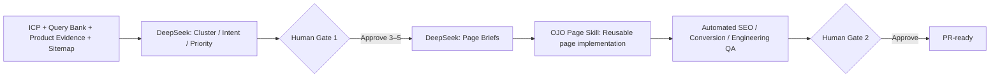

# Query-to-Page Agent

把高意图 Query Bank 变成一批可审核、可追踪、可交付的 SEO 页面。Agent 自动完成聚类、意图判断、页面映射、Brief 和 QA；两个 Human Gate 保留“做哪些页”和“是否上线”的最终决定。

> Personal portfolio project by prudenceyang167-rgb. 仓库只包含工作流代码与合成示例，不包含公司 Query Bank、客户数据、密钥、未公开指标或复制的产品源码。

## Why this exists

单页生产已经不再是最难的问题。真正占用时间的是每页前后的重复判断：这个 Query 是否值得做、是否撞车、该做哪种页面、产品卖点是否有依据、页面能否通过 SEO / Mobile / Conversion / Engineering QA。

这个项目把这些工作串成一个有审计记录的批量生产系统：



Agent 不会自行批准页面方向、虚构产品证据、绕过 QA、提交 PR 或上线。

## What is implemented

- Query clustering、Search Intent、ICP relevance、Commercial intent、Funnel stage、已有页面覆盖与 Cannibalization risk。
- `optimize-existing`、`create-use-case`、`create-comparison`、`create-landing`、`create-blog` 页面决策。
- P0 / P1 / P2 排序，以及严格限制为 3–5 页的 MVP Gate 1 Packet。
- DeepSeek 驱动的页面 Brief：H1、结构、核心 Copy、能力—收益—证据、CTA、FAQ、内链、Schema、Title 和 Description。
- 页面 Skill 交接清单与 draft manifest；OJO 项目默认调用 `ojo-solution-pages`，并要求复用现有组件和 IA。
- SEO、Product / Conversion、Mobile、Component reuse、Build、Type check、CI 和 Performance 的证据化 QA。
- 双人工 Gate 状态机：缺少必要证据会记为 `Not run`，不会被误判成 `Pass`。
- MVP 指标定义：单页人工耗时、自动化率、QA Issue、生产周期和上线成功率。

## Two ways to run it

### 1. As a Codex Skill

安装本仓库 Skill 后调用：

```text
Use $ojo-query-to-page-agent to turn this query bank into a gated batch of 3–5 high-intent pages.
```

Codex 会读取目标仓库里的页面 Skill、设计系统和工程命令，完成页面代码与 Preview 检查。工作流会在两个 Gate 停下来等待具名 Reviewer。

### 2. With the DeepSeek CLI

项目只使用 Python 标准库，不需要额外运行时依赖：

```bash
python3 -m venv .venv
source .venv/bin/activate
python3 -m pip install -e .
```

把 DeepSeek 密钥放进本地 shell；如果保存在被 Git 忽略的 `.env.local`，请先把它载入 shell。不要提交真实密钥。默认使用 `deepseek-flash`，也可用 `DEEPSEEK_MODEL` 覆盖。

```bash
export DEEPSEEK_API_KEY="your-local-key"

q2p analyze \
  --config /path/to/run-config.json \
  --run-dir .runs/mvp

q2p gate \
  --run-dir .runs/mvp \
  --gate 1 \
  --decision approve \
  --reviewer "Prudence"

q2p briefs --run-dir .runs/mvp
```

页面 Skill 实现完成后，把 `page-manifest.draft.json` 补齐为正式 manifest，删除顶层的 `"draft": true`，并记录每页代码、Preview 与视觉/性能证据：

```bash
q2p qa \
  --run-dir .runs/mvp \
  --manifest .runs/mvp/page-manifest.json

q2p gate \
  --run-dir .runs/mvp \
  --gate 2 \
  --decision approve \
  --reviewer "Prudence"
```

Gate 2 存在 `Fail` 或必要项 `Not run` 时，状态机拒绝批准。

### Data boundary

运行 DeepSeek 阶段会把配置中八类输入的文本发送给外部模型。只使用已获准发送到 DeepSeek 的资料，不要把客户数据、密钥、受限源码或未获授权的内部信息放入输入。加载器会跳过常见凭据文件并遮蔽常见 secret 形式，但这不是数据授权的替代品。

## Offline demo

演示数据完全合成，不调用 API：

```bash
q2p analyze \
  --config examples/synthetic/config.json \
  --run-dir .runs/demo \
  --fixture-json examples/synthetic/prioritization.json

q2p gate --run-dir .runs/demo --gate 1 --decision approve --reviewer "Demo reviewer"

q2p briefs \
  --run-dir .runs/demo \
  --fixture-json examples/synthetic/briefs.json
```

运行结果保存在 `.runs/demo/`，包括输入清单、优先级、两个 Gate Packet、Query → Page Map、Brief、Manifest 和 QA 报告。

## Run config

从 [`assets/templates/run-config.json`](assets/templates/run-config.json) 开始。八类必需输入是：ICP、Query Bank、产品能力证据、已有 Sitemap、Use Case 分类、页面 Skill、Homepage / Design System 和 SEO Rules。

`qa_commands` 必须是参数数组，不经过 shell 执行。例如：

```json
{
  "qa_commands": {
    "build": ["pnpm", "build"],
    "type-check": ["pnpm", "type-check"],
    "ci": ["pnpm", "test"]
  }
}
```

## Repository map

```text
query_to_page_agent/
  cli.py                 DeepSeek CLI
  pipeline.py            Analysis, briefs, QA, artifact rendering
  provider.py            Provider boundary and offline fixture model
scripts/workflow_state.py Two Human Gates and artifact validation
SKILL.md                  Codex Agent workflow
references/               Input, prioritization, QA and metric contracts
assets/templates/         Reusable run templates
examples/synthetic/       Safe offline demonstration
tests/                    State-machine and pipeline tests
```

## Verification

```bash
python3 -m unittest discover -s tests -v
```

扩到 10–20 页前，先完成一次 3–5 页 MVP 并复盘指标。任何重复性的模板、产品证据、路由或 QA Failure 都应该先修复，再放大批量。

## License

[MIT](LICENSE)
